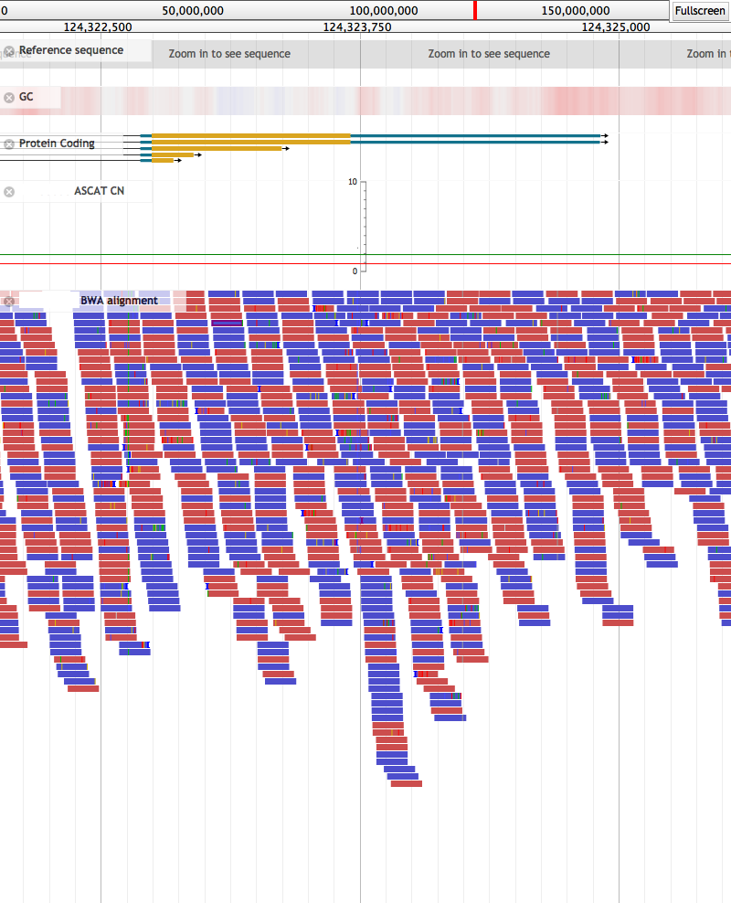

# Summary

This project is provides scripts and tools which work with or on JBrowse [@jbrowse] that
are considered publicly useful.

Currently there is only a single tool `jbrowse_rasterize.js` which is used to
generate sets of images from a JBrowse instance using puppeteer [@puppeteer].

The intent for this was to replace the 'screen-shot' functionality of GBrowse [@gbrowse]
where it was possible to script large sets of image generation using `curl` and
automated URL generation.  JBrowse itself doesn't directly support screenshots
and there are many interface elements that detract from a clean publication quality
image as well as the limitation of only being able to capture the viewable area.

`jbrowse_rasterize` dynamically handles the image height and provides command line options to hide
and modify section of the user interface which are not relevant for image capture.

Usage is simple, see [jbrowse_rasterize#usage][jbrast-usage] for more details.

-

# References

<!-- ref-links -->
[jbrast-usage]: https://github.com/cancerit/cgpJBrowseToolkit/blob/master/README.md#usage
